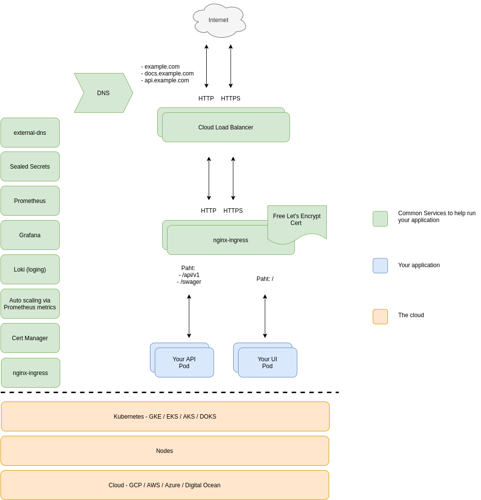

# kubernetes-common-services

# Table of Content
- [Table of Content](#table-of-content)
  * [What is this project](#what-is-this-project)
  * [Who is this project for](#who-is-this-project-for)
  * [Why do I want to use this project](#why-do-i-want-to-use-this-project)
  * [What this project provides](#what-this-project-provides)
  * [Who is using this:](#who-is-using-this-)
  * [Supported Services](#supported-services)
  * [Do I have to use every single one of these services?](#do-i-have-to-use-every-single-one-of-these-services-)
- [How this works](#how-this-works)
- [How to set this up](#how-to-set-this-up)
  * [A step by step guide](#a-step-by-step-guide)
- [Community](#community)

<small><i><a href='http://ecotrust-canada.github.io/markdown-toc/'>Table of contents generated with markdown-toc</a></i></small>

## What is this project
This project is here to make it easier to run common services in kubernetes by taking care of it for you so that you can get to working on your application faster instead of dealing with infrastructure components.

When running your application in Kubernetes, you often add various open source applications to your cluster to help you automatically get Let's Encrypt certificates for your HTTPS endpoints and automatically renewing them, automatically sync DNS entries that you have on an ingress to your DNS provider, monitoring and alerting for your cluster, and many more items.

These services are super fantastic and works really well but it takes time to set them up, integrate it into your cluster and then over the lifetime of it, you have to revisit each one to update them.  This is all undifferentiated heavy lifting that you have to take care of in addition to your own application.

This project integrates and maintains (with updates) all of these open source applications for you so you don't have to do it.

## Who is this project for
This project is for people who do not want to manage these common applications and let the open source community manage it.  Just like how you don't manage the various pieces to Kubernetes and integrate it together, you instead use a product like GKE, EKS, AKS, Rancher, Kops, Kubespray, etc.  You don't also have to manage these common Kubernetes services either.  If you want to offload that work, this project is for you.

## Why do I want to use this project
Setting up and maintaining these application and integrating it with your cloud is a lot of work you have to do before you even start on your application.  This project helps accelerate your process and gets you to running your application on Kubernetes faster by taking care of the undifferentiated heavy lifting of the infrastructure work for you and keeping it maintained going forward.

## What this project provides
There is no magic here.  Everything in here you can do and everything we use is absolutely 100% open source.  The value add this project provides is an opinionated way of deploying these items and the curration of each service.  We put in the work to make sure everything is structured correctly, updated in a timely manor, and reasonably easy to use.  The other major piece is that we validate that these pieces are working in various types of Kubernetes clusters and clouds.

## Who is using this:

|                                           |
|-------------------------------------------|
| [Parsable.com](https://www.parsable.com/) |
| [up.audio](https://up.audio/)             |
| [karunalabs.com](https://karunalabs.com/) |
|                                           |

If you too are using kubernetes-common-services; please submit a PR to add your organization to the list!

## Supported Services

* [cert-manager](https://github.com/jetstack/cert-manager) (For HTTPS certs)
* [cluster-turndown](https://github.com/kubecost/cluster-turndown) (Automated turndown of Kubernetes clusters on specific schedules.)
* [external-dns](https://github.com/helm/charts/tree/master/stable/external-dns) (manages your DNS automatically via annotations)
* [kube-metric-adapter](https://github.com/zalando-incubator/kube-metrics-adapter) (Scale by any Prometheus metrics)
* [nginx-ingress](https://github.com/helm/charts/tree/master/stable/nginx-ingress) (To expose HTTP services to consumers from outside of the cluster such as the internet)
* [prometheus-blockbox-exporter](https://github.com/prometheus/blackbox_exporter) (checks on URLs)
* [prometheus-operator](https://github.com/helm/charts/tree/master/stable/prometheus-operator) (Monitoring and alerting for your cluster)
* [sealed-secrets](https://github.com/bitnami-labs/sealed-secrets) (Keep your secrets encrypted in Git and delivered as secrets into Kubernetes)

If you don't see a service that you want to use but want us to support it, please open an issue in this project and let us know!

## Do I have to use every single one of these services?
No, you can pick and choose which one you want to use.

# How this works
We are leveraging [Weaveworks Flux](https://github.com/fluxcd/flux) to provide us with the GitOps workflow.  

# How to set this up

## A step by step guide

This is an indepth step by step guide on how to implement this project and how to use it.

[The guide](https://github.com/ManagedKube/kubernetes-common-services/blob/master/docs/setup-guide.md)

# Community

* Email: help@managedkube.com
* [@gar454 on Kubernetes Slack](https://app.slack.com/client/T09NY5SBT/D1QQUQEG1)
